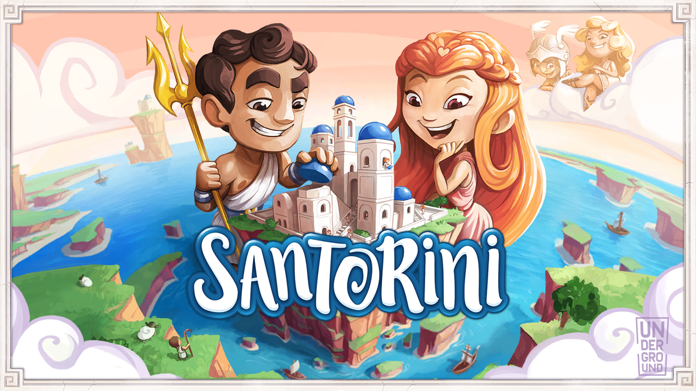

# Prova finale Ingegneria del Software - a.a. 2019/2020

## *Santorini*

## Developers

-   Luca Maniscalchi #10583576 ([@lucamaniscalchi](https://github.com/lucamaniscalchi))
-   Rebecca Margarini #10636842 ([@rebeccamargarini](https://github.com/rebeccamargarini))
-   Giacomo Mosca #10574012 ([@GiacomoMosca](https://github.com/GiacomoMosca))

## Functionalities

| Functionality | State |
|:-----------------------|:------------------------------------:|
| Complete rules |  |
| CLI |  |
| GUI |  |
| Socket |  |
| Multiple games |  |
| Advanced Gods |  |
| Persistence |  |
| Undo |  |

<!--

-->

## Instructions

### Server

`java -jar ServerApp.jar`

### Client

Two separate client JARs were built to easily choose between CLI and GUI interfaces.

For CLI:
`java -jar ClientCLI.jar`

For GUI:
`java -jar ClientGUI.jar`
